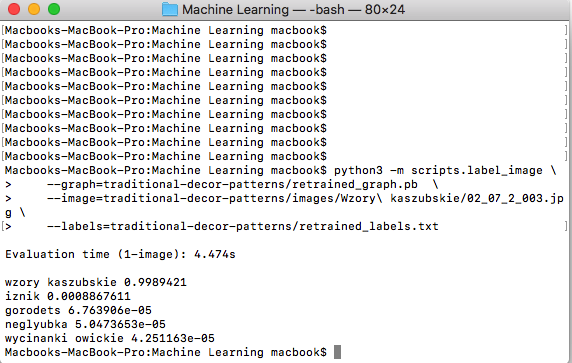

####Preparation of the database
* `tensorflow` and `tensorboard` libraries need to be installed according to the [following instruction](https://codelabs.developers.google.com/codelabs/tensorflow-for-poets).

* Next, we set properties `IMAGE_SIZE` and `ARCHITECTURE` to convenient values (I used the same ones as in the examle):

```
IMAGE_SIZE=224
ARCHITECTURE="mobilenet_0.50_${IMAGE_SIZE}"
```

* Then, we can run `001.py` script with a following command `python3 001.py` which, on the basis of the data contained in `decor.cvs`, will move the images to the right folders.

####Image conversion to JPEG format

Now, we want to convert all these `png` files into `jpg` files because of instructions which I got by mail **"This training script doesn't like other files than JPEG : )"**. In order to achive this we will use `PIL` library.

* By using the command `pip3 install pillow`, the library will be installed.

* Then, we run `002` script by using `python3 001.py` command which, by the use of the installed library, will convert all `png` files to `jpg` format.

####Run the training:

After these preparations, we can run following command:

```
python3 -m scripts.retrain \
  --bottleneck_dir=traditional-decor-patterns/bottlenecks \
  --how_many_training_steps=500 \
  --model_dir=traditional-decor-patterns/models/ \
  --summaries_dir=traditional-decor-patterns/training_summaries/"${ARCHITECTURE}" \
  --output_graph=traditional-decor-patterns/retrained_graph.pb \
  --output_labels=traditional-decor-patterns/retrained_labels.txt \
  --architecture="${ARCHITECTURE}" \
  --image_dir=traditional-decor-patterns/images
```

all values in this command are default and they come from the previously given link.

####Testing

I chose native `02_07_2_003.jpg` file for testing on which Kashubian pattern is presented. We run this command:

```
python3 -m scripts.label_image \
    --graph=traditional-decor-patterns/retrained_graph.pb  \
    --image=traditional-decor-patterns/images/Wzory\ kaszubskie/02_07_2_003.jpg \
    --labels=traditional-decor-patterns/retrained_labels.txt
```
 few seconds after we will get a result similar to the following one:

```
wzory kaszubskie 0.9989421
iznik 0.0008867611
gorodets 6.763906e-05
neglyubka 5.0473653e-05
wycinanki owickie 4.251163e-05
```

I enclose a screenshot of this result:

