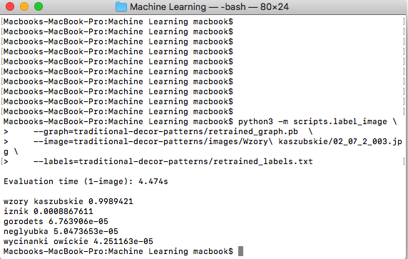

**Przygotowanie bazy plików**

* Należy mieć zainstalowany `tensorflow` oraz `tensorboard` wedle instrukcji zawartej [tutaj](https://codelabs.developers.google.com/codelabs/tensorflow-for-poets).

* Ustawiamy dogodne dla nas wielkości `IMAGE_SIZE` oraz `ARCHITECTURE`:

```
IMAGE_SIZE=224
ARCHITECTURE="mobilenet_0.50_${IMAGE_SIZE}"
```

* Uruchamiamy skrypt `001.py` poleceniem `python3 001.py`, który na podstawie danych zawartych w pliku `decor.cvs` wrzuci obrazy do odpowiednich katalogów.

**Konwersja plików do formatu JPEG**

Następnie (można to oczywiście było zrobić również wcześniej) chcemy pliki typu `png` przerobić na pliki typu `jpg` wedle informacji jakiej dostałem na mailu **"This training script doesn't like other files than JPEG : )"**. W tym celu wykorzystamy bibliotekę `PIL`.

* Instalujemy bibliotekę przy pomocy polecenia `pip3 install pillow`

* Uruchamiamy drugi ze skryptów o osobliwej nazwie `002` poleceniem `python3 001.py`, który przy pomocy zainstalowanej biblioteki przekonwertuje wszystkie pliki `png` do formatu `jpg`.

**Uruchomienie ćwiczenia/nauki bazy:**

Uruchamiamy polecenie:

```
python3 -m scripts.retrain \
  --bottleneck_dir=traditional-decor-patterns/bottlenecks \
  --how_many_training_steps=500 \
  --model_dir=traditional-decor-patterns/models/ \
  --summaries_dir=traditional-decor-patterns/training_summaries/"${ARCHITECTURE}" \
  --output_graph=traditional-decor-patterns/retrained_graph.pb \
  --output_labels=traditional-decor-patterns/retrained_labels.txt \
  --architecture="${ARCHITECTURE}" \
  --image_dir=traditional-decor-patterns/images
```

wszystkie wartości w powyższym poleceniu są wartoścami domyślnymi z linku podanym wcześniej.

**Test**

Do testów wybrałem rodzimy plik `02_07_2_003.jpg` przedstawiający wzór kaszubski. Uruchamiamy polecenie:

```
python3 -m scripts.label_image \
    --graph=traditional-decor-patterns/retrained_graph.pb  \
    --image=traditional-decor-patterns/images/Wzory\ kaszubskie/02_07_2_003.jpg \
    --labels=traditional-decor-patterns/retrained_labels.txt
```

Następnie, po kilku westchnieniach, otrzymujemy podobny wynik do poniższego:

```
wzory kaszubskie 0.9989421
iznik 0.0008867611
gorodets 6.763906e-05
neglyubka 5.0473653e-05
wycinanki owickie 4.251163e-05
```

Załączam również skrin z otrzymanego wyniku:

